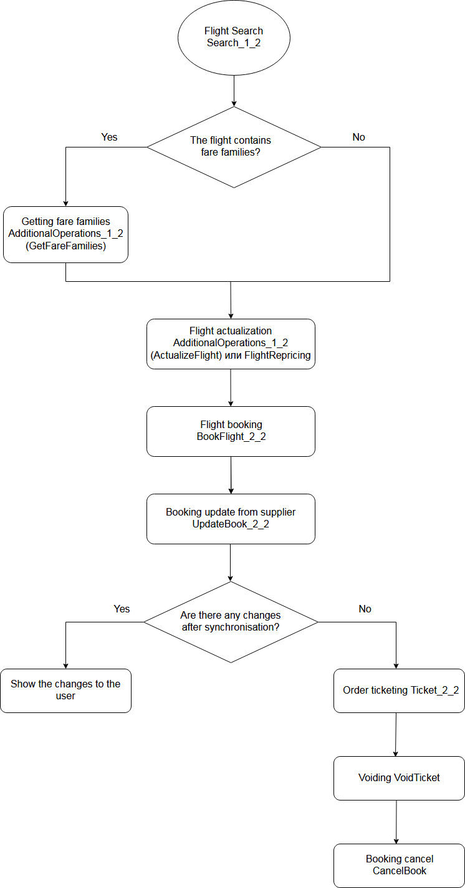

To issue a ticket using the Nemo Connect web service, it is needed to perform several operations in sequence:

- Search and selection of a flight with a suitable fare
- Booking of the selected flight
- Ticketing

Each operation can be carried out using one or more requests to the web service. The sequence of executed requests can vary depending on your needs, but there is an approximate order that is recommended to follow: searching for airline flights, checking seats availability, booking a flight (obtained on the prevous step), transmission of passenger data (if they were not transmitted during the booking), ticketing and getting ticket numbers. Some airlines (for example, [S7 Airlines](https://www.s7.ru/home/info/fares.dot)) provide an opportunity to choose the fare family on which various parameters of flight depend, for example, weight of the baggage which can be carried with you on board the plane or the ticket refunding conditions. During the booking on the side of the supplier and Nemo, the entity of the order with its unique ID will be created and subsequent requests will already work not with the flight but with the created order. Airlines have restrictions on the lifetime of unticketed orders, after which the order will be canceled by the supplier; it is also possible that the airline cancels the order or changes the cost of the flight even before the end of the time-limit, so it is strongly recommended to synchronize the order with the supplier before the payment. Below is the possible algoritm of issuing the ticket with the used requests specified. 

>>>> Please use the newest versions of the requests.

More details on the various processes and information for each request is described in the following articles.
