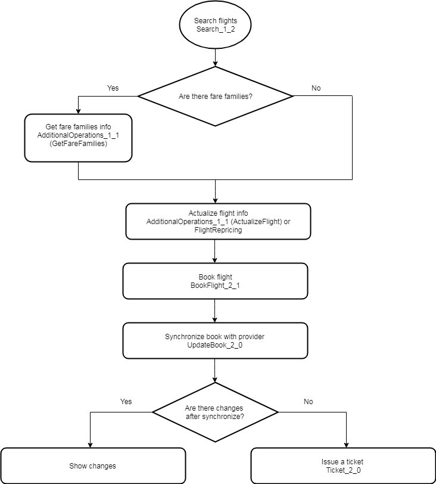

To issue a ticket using the Nemo Connect web service, need to perform several operations in sequence:

- Search and selection of a flight with a suitable fare
- Book of the selected flight
- Ticketing

Each operation can be carried out using one or more requests to the web service. The sequence of requests can vary, depending on your needs, but there is an approximate order that is recommended - search for airline flights, check the seats availability, booking a flight which wes getting before, sending of passenger data if they were not transmitted during the booking, also ticketing and getting ticket numbers. Some airlines (for example, [S7 Airlines](https://www.s7.ru/home/info/fares.dot)) provide an opportunity to choose the fare family,which has influence on various parameters of flight, for example baggage weight, which can be taken with you to the plane or the ticket refunding conditions. During the booking on the supplier's side and Nemo, the essence of the order with its unique identifier will be created and subsequent requests will already work not with the flight but with the created order. Airlines have restrictions on the lifetime of unticked orders, after which the order will be canceled by the supplier, it is also possible that the airline even before the end of the time-limit cancels the order or changes the cost of the flight, so it is strongly recommended to synchronize the order with the supplier before the payment. Below is the possible algoritm of issuing the ticket specifying the requests used.

>>>> Please use the newest versions of the requests.

More details on the various processes and information for each request will be described in the following articles.
