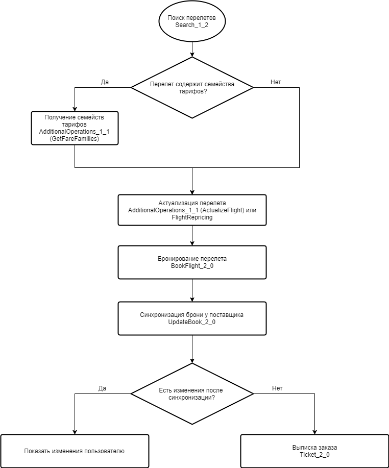

Для оформления авиабилета с помощью веб-сервиса Nemo Connect, необходимо последовательно выполнить несколько операций:

- Поиск и выбор авиа рейса с подходящим тарифом
- Бронирование выбранного перелета
- Выписка заказа

Каждая операция может быть выполнена с использованием одного или более запросов к веб-сервису. Последовательность выполняемых запросов может различатся, в зависимости от ваших нужд, но есть примерный порядок, который рекомендуется соблюдать - поиск рейсов авиакомпаний, проверка доступности/наличия мест, бронирование заказа, передача пассажирских данных, если они не были переданы во время бронирования, выписка и получение номеров билетов. Некоторые авиакомпании (например [S7 Airlines](https://www.s7.ru/info/fares.dot)) предоставляют возможность выбрать не только тариф, но и семейство тарифа, от семейства тарифа зависят различные параметры перелета, например вес багажа, который можно взять с собой в самолет или условия возврата билета и тд. Во время бронирования на стороне поставщика и Nemo будет создана сущность заказа со своим уникальным идентификтором и последующие запросы уже будут работать не с перелетом а с созданным заказом. У авиакомпаний есть ограничения на время существования не выписанных заказов, по истечению которого заказ будет аннулирован поставщиком, так же возможны ситуации, когда авиакомпания еще до истечения таймлимита аннулирует заказ или изменяет стоимость перелета, поэтому настоятельно рекомендуется перед оплатой заказа пользователем провести синхронизацию заказа с поставщиком. Ниже приведен возможный алогоритм оформления авиабилета с указанием используемых запросов.

Подробнее по различным процессам и по каждому запросу будет описано в следующих статьях.