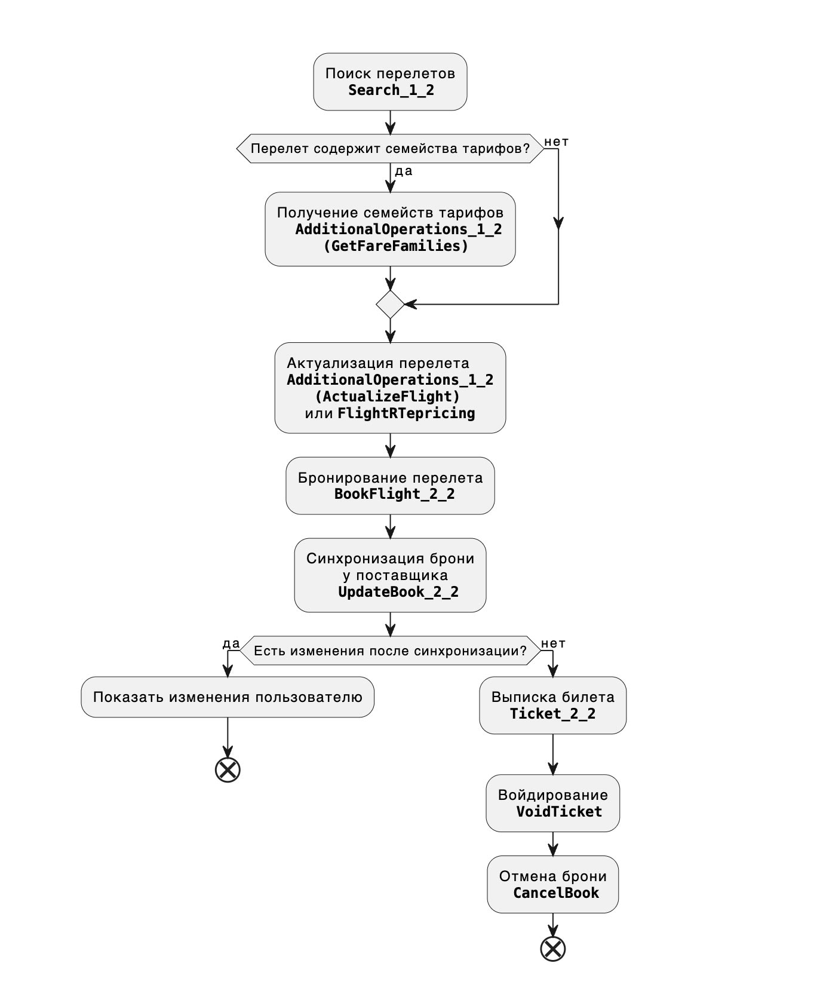

Для оформления авиабилета с помощью веб-сервиса Nemo Connect необходимо последовательно выполнить несколько операций:

- Поиск и выбор авиа рейса с подходящим тарифом
- Бронирование выбранного перелета
- Выписка заказа

Каждая операция может быть выполнена с использованием одного или более запросов к веб-сервису. Последовательность выполняемых запросов может различаться, в зависимости от ваших нужд, но есть примерный порядок, который рекомендуется соблюдать - поиск рейсов авиакомпаний, проверка доступности/наличия мест, бронирование перелета (полученного на предыдущем шаге), передача пассажирских данных, если они не были переданы во время бронирования, выписка и получение номеров билетов. Некоторые авиакомпании (например [S7 Airlines](https://www.s7.ru/info/fares.dot)) предоставляют возможность выбрать семейство тарифа, от которого зависят различные параметры перелета, например, вес допустимого багажа или условия возврата билета. Во время бронирования на стороне поставщика и Nemo будет создана сущность заказа со своим уникальным идентификатором и последующие запросы будут работать уже не с перелетом, а с созданным заказом. У авиакомпаний есть ограничения на время существования не выписанных заказов, по истечению которого заказ будет аннулирован поставщиком, также возможны ситуации, когда авиакомпания еще до истечения таймлимита аннулирует заказ или изменяет стоимость перелета, поэтому настоятельно рекомендуется перед оплатой заказа пользователем провести синхронизацию заказа с поставщиком. Ниже приведен возможный алогоритм оформления авиабилета с указанием используемых запросов.

>>>> При реализации интеграции с Nemo Connect необходимо всегда использовать последнюю из имеющихся версий запросов.

>>>> Передача заголовка SOAPAction обязательна.

>>>> Получение УПТ (условия применения тарифов) при помощи запроса AdditionalOperations_1_2 (GetFareRules) обязательно к реализации для поставщиков поддерживающих данный функционал, если невозможно указание ссылки на УПТ со стороны клиента. 

>>>> Запросы указанные в блок-схеме являются обязательными для реализации, за исключением GetFareFamilies, если функционал выбора тарифа не поддерживается на стороне клиента/поставщика.

Подробнее по различным процессам и по каждому запросу будет описано в следующих статьях.
